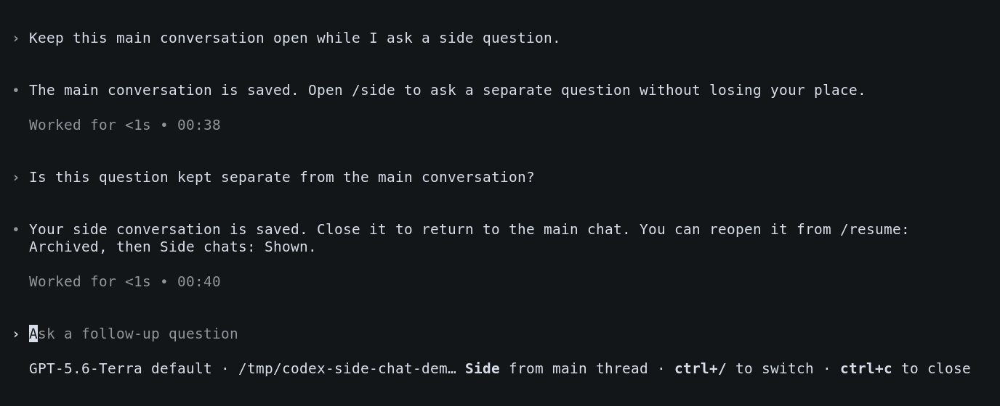
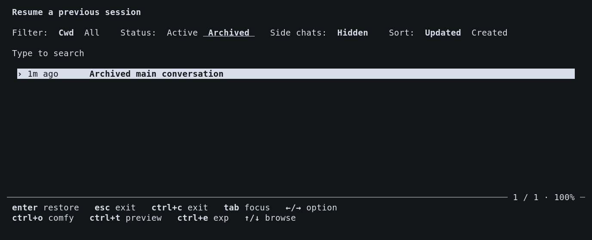
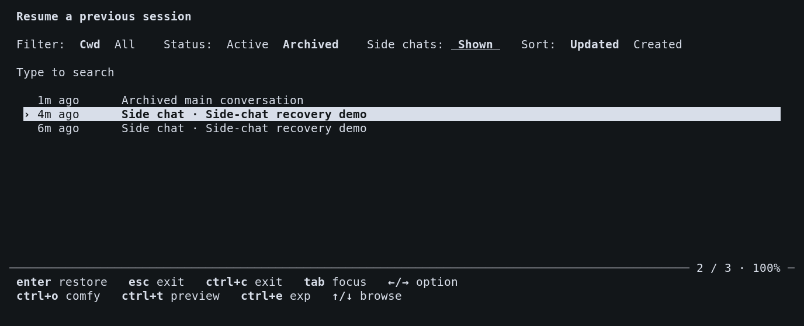
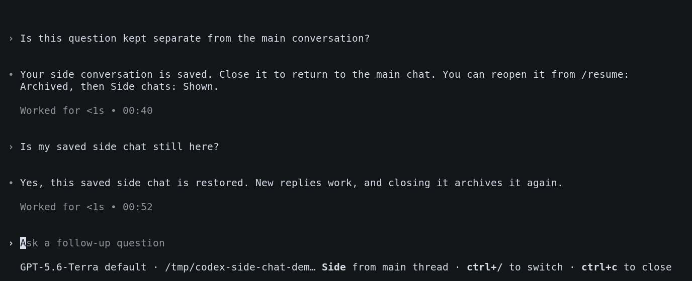

# Side-chat recovery screenshots

Captured from the running `codex-tui` built at `b50a8a60d76f616150f71103a4b7179ac35b3812`. The app used an isolated profile and demo workspace with a local backend providing scripted sample responses. These are original terminal-window screenshots.

The walkthrough opened side conversations with `/side`, closed them with Ctrl+C, exited and restarted the app, and restored an archived side conversation through `/resume`. A new follow-up received a reply after restoration.

## Side conversation and navigation

The side conversation retains its history and displays controls to switch to the parent or close it.

## Archived side chats hidden by default

The archived-session picker initially shows regular conversations with **Side chats: Hidden**.

## Show archived side chats

Changing the filter to **Side chats: Shown** reveals saved conversations marked **Side chat**. Enter restores the selected conversation.

## Restored conversation receives a new reply

After restarting and reopening the saved conversation, its previous history and a new follow-up reply appear together. Parent navigation and close controls remain available.

